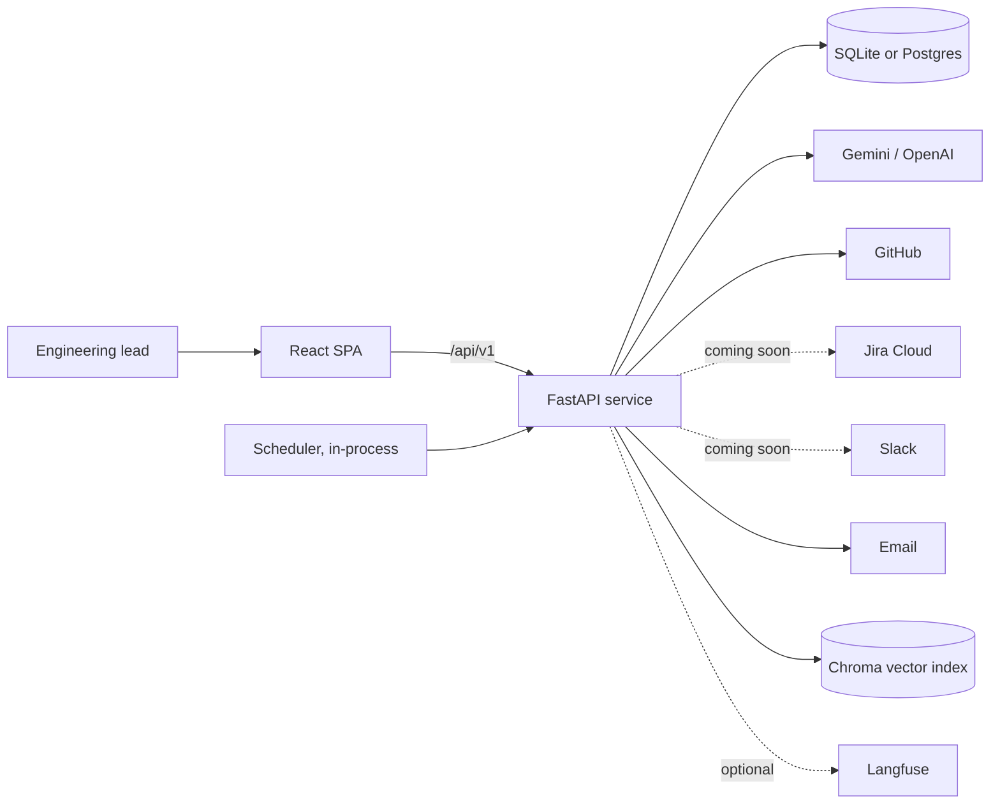
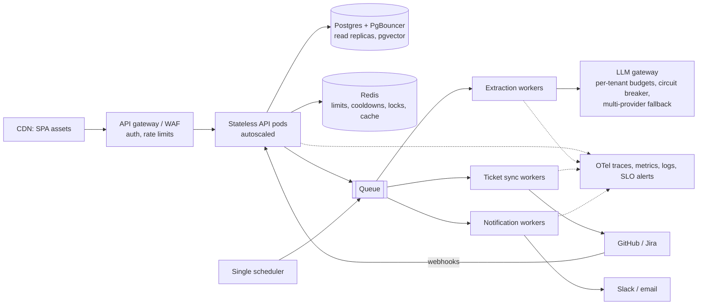

# Architecture and scaling

This document explains how the Promise vs. Progress engine is built, why it is built that way, and what changes
when it has to serve thousands of teams instead of one. It describes the code as it is today and is honest about
where that code stops scaling.

## 1. The problem it solves

Meeting assistants capture action items, and then the loop stops. Nobody checks, before the next meeting, whether
what was promised actually shipped. So the next meeting starts with a round of status questions, and "done"
often means "someone said it's done".

The engine closes that loop:

```
transcript -> extract commitments -> human review -> ticket in GitHub (Jira: coming soon)
                                                            |
next meeting <- briefing (email; Slack: coming soon) <- reconcile against the tracker (on demand, hourly, or scheduled)
```

The central idea is **evidence over claims**. A commitment only counts as done when the tracker says so: a PR is
merged, an issue is closed as completed, or a Jira issue is in the *Done* status category. When someone says
"it's done" and the tracker disagrees, the commitment is shown as **Claimed, unverified**. That gap is the
reason the product exists.

## 2. System context



One deployable backend service, one SPA and one database. That is a deliberate choice for an assessment: it is
easy to run, review and reason about. Section 8 describes how it splits apart at scale.

**Integration status.** GitHub is live. Jira and Slack are built, tested and switched off with
`ENABLED_INTEGRATIONS=github`; the UI shows them as *Coming soon*. While Jira is off, commitments that mention a
Jira key are tracked as GitHub issues.

## 3. Layers and the dependency rule

A request always flows in one direction:

**router -> controller -> workflow -> (agent -> chain -> LLM client) or connectors, plus repositories**

| Layer | Folder | Owns | Must not |
|---|---|---|---|
| HTTP | `routers/v1/` | URLs, status codes, request/response models | contain logic |
| Use case | `controllers/` | permission checks ("is this the user's meeting?"), orchestration | return HTTP errors (they raise domain errors; `main.py` maps them) |
| Pipelines | `workflows/` | multi-step processes: ingest, review, reconcile, brief, audit | know about HTTP |
| AI | `agents/`, `chains/`, `llms/`, `prompts/` | agent = repair loop and fallback; chain = prompt -> JSON -> validated model; client = provider, retries, fallback model | leak a vendor SDK above `llms/` |
| Deterministic tools | `tools/` | date resolution, name matching, rule-based extraction | call the network |
| Integrations | `services/connectors/` | GitHub and Jira (trackers), Slack (notifier), credential resolution | be called by anything but workflows and controllers |
| Domain services | `services/` | reconciliation verdicts (pure), briefing HTML, Slack messages, email, search, scheduler | depend on HTTP |
| Data | `models/`, `repositories/`, `migrations/` | tables, every query, schema history | run a query without the owner filter |
| Cross-cutting | `config/`, `utils/` | one `.env`, logging, tracing, security, rate limits | hold business logic |

Two rules carry most of the weight:

- **Tenant isolation lives in the repositories.** Every query filters by `owner_id`, and other users' records
  return 404, not 403, so IDs cannot be probed.
- **Vendors live behind interfaces.** Workflows call `TrackerConnector.sync/verify` and `NotifierConnector.send`.
  They never know whether the ticket is in GitHub or Jira, and adding a tool is one new class.

## 4. The four flows

### Ingest a transcript
`POST /meetings/` -> `ingest_meeting`
0. Caption files from Teams or Zoom (`.vtt`, `.srt`) are converted to "Name: text" lines by `tools/transcript_converter.py`. The wizard previews this through `POST /meetings/transcript/convert`, and ingestion applies it again for raw captions sent through the API.
1. The **agent** asks the **extraction chain** for commitments. The chain builds the prompt (the transcript is
   marked as untrusted data, and a 14-day calendar is included so "by Friday" becomes a real date), calls the LLM
   in JSON mode and validates the result with Pydantic.
2. If the JSON is invalid, the agent sends a **repair prompt** with the validation error, once. If the LLM keeps
   failing, the **rule-based extractor** takes over. The product degrades; it doesn't break.
3. **Grounding** fixes what the model shouldn't be trusted with:
   - it maps spoken names to the participant list;
   - it fills missing dates from the quoted sentence;
   - completed work gets no deadline;
   - a "PR" without a number is tracked as an issue.
4. Jira keys route to Jira, and new tickets follow the user's default tracker.
5. The meeting and its **pending** commitments are saved and indexed for semantic search.

Nothing reaches GitHub or Jira at this point. Every commitment waits for a human.

### Review
`POST /commitments/review` -> `apply_review`: exactly the approved and rejected IDs are applied. Everything else
stays pending. Approved tasks are grouped by tracker, and each connector creates the ticket or links the one
that was mentioned. A failure is recorded on that task and can be retried. It never rolls back the others.

### Two-way sync (GitHub)
Editing a synced commitment calls `TrackerConnector.push_update`:
- it posts an audit comment;
- it closes, reopens or retitles the issue;
- PRs are only commented on.

When the app closes an issue, it stores GitHub's `closed_at` for that close in `tasks.app_closed_marker`. During verification, a close with that same timestamp becomes `CLOSED_FROM_APP`, which counts as a claim. A different close event, made by someone in GitHub, becomes `VERIFIED_DONE`. This keeps two-way sync from breaking the evidence-over-claims rule.

### Reconcile
`POST /reconciliation/run` -> `refresh_verification` -> `build_report`
- Each tracker is asked for the real state, with bounded concurrency.
- `build_report` is a **pure function**: it turns stored state into verdicts (Verified done, Claimed unverified,
  Overdue, Due today, Blocked, At risk, On track), each with a risk score and the reason behind it.
- `GET /reconciliation/report` only reads. Only `run` and the scheduler call external APIs.

### Pre-meeting audit
The scheduler (jobs are rebuilt from the database on startup) runs reconcile -> briefing -> email and/or Slack,
and records the run. The briefing narrative comes from the LLM as validated JSON text only. All figures and HTML
come from code and an autoescaped template.

## 5. Data model

| Table | Purpose |
|---|---|
| `users` | account, encrypted per-user LLM keys, default tracker |
| `meetings` | transcript, participants, summary, extraction source, Langfuse trace id |
| `tasks` | the commitment (owner, title, quote, date, priority), review state, tracker link, verification state |
| `integrations` | per-user GitHub / Jira / Slack connection; settings as JSON, secrets as one encrypted blob |
| `scheduled_audits`, `email_logs` | schedules and delivery history |

Self-reported status (`status`) and evidence (`verification_status`) are separate columns. Only evidence counts
toward completion. Schema changes go through Alembic migrations, which are tested on SQLite and Postgres in CI.

## 6. AI design choices

- **The LLM proposes; code and people decide.** Structured JSON output, Pydantic validation, grounding and a
  human review gate mean a hallucination can at worst become a pending suggestion that someone rejects.
- **Prompt, not patches.** Ticket titles, priority and exclusions (parked work, "I'll ping you", recaps, fallbacks)
  are taught in the prompt with examples from *other* meetings, so the samples in `samples/` test real
  generalisation.
- **Resilience:**
  - retries with backoff on 429/5xx;
  - automatic switch to a fallback model;
  - a quota cooldown so a spent model is skipped;
  - the rule-based fallback;
  - timeouts everywhere.
- **Safety:**
  - transcripts are treated as untrusted input;
  - the LLM never produces HTML;
  - meeting text posted to Slack is escaped, so it cannot trigger `@channel`.
- **Observability:** optional Langfuse traces for every workflow, with the model, tokens, cost and latency of each
  LLM call. Tracing can never fail a request.

## 7. Security

- JWT auth, bcrypt, rate-limited login and sign-up, and password policy.
- Per-user secrets (LLM keys, GitHub/Jira/Slack credentials) are Fernet-encrypted, returned only masked, and
  never logged. Logs carry user IDs, not emails.
- **SSRF protection:** connectors only call the tools' own domains (`github.com`, `*.atlassian.net`,
  `hooks.slack.com`). IP addresses and other hosts are rejected unless allow-listed in
  `INTEGRATION_ALLOWED_HOSTS`.
- CORS restricted to configured origins, security headers and a CSP in nginx, and `/docs` disabled in production.

## 8. Scaling: where it stops, and what changes

The current build is sized for one team per deployment. The table lists what breaks first as usage grows, in
order, and the standard fix for each.

| # | Today | What happens at thousands of concurrent users | At scale |
|---|---|---|---|
| 1 | LLM extraction runs **inside the HTTP request** (about 5-45 s) | Requests pile up, and provider rate limits cause timeouts | **Job queue**: return `202 Accepted` with a job id, let workers call the LLM with bounded concurrency, and have the UI poll or stream |
| 2 | SQLite by default | One writer at a time | **Postgres** (already supported and CI-tested) behind PgBouncer, with read replicas for reports |
| 3 | Rate limits, model cooldowns and the vector index are **per process / local disk** | Replicas disagree, and search differs per pod | **Redis** for limits, cooldowns and locks; **pgvector** or a managed vector store |
| 4 | Scheduler runs **inside the API process** | N replicas fire every job N times | One scheduler (CronJob or leader lock) that only **enqueues** jobs, with idempotency keys |
| 5 | Trackers are **polled** hourly for every user in one loop | Doesn't finish in time at 100k users, and exhausts GitHub/Jira API quotas | **GitHub/Jira webhooks** for real-time state; polling becomes a slow safety net, sharded per tenant |
| 6 | One uvicorn process, file logs | No horizontal scaling; logs lost with the container | Stateless pods with autoscaling, JSON logs to stdout, Prometheus metrics, OpenTelemetry traces |
| 7 | Lists are not paginated | Large accounts get large responses | Cursor pagination |
| 8 | Encryption key derived from `SECRET_KEY` | Rotation breaks stored credentials | KMS envelope encryption with key versions |

### Target architecture



### Where the real bottleneck is
Serving pages and reports is cheap: an indexed Postgres query per request, and stateless pods scale out
linearly. **The binding constraint is LLM throughput.** Every transcript costs one call of several seconds, and
providers cap requests and tokens per minute. So the design has to:

- **Absorb bursts with a queue** instead of holding HTTP connections open.
- **Apply backpressure and fairness:** per-tenant concurrency limits and token budgets, so one team cannot starve
  the rest.
- **Degrade, don't fail:** fallback model, then the rule-based extractor. Both exist today.
- **Measure cost per meeting:** tokens and cost per call are already traced, so budgets can be set from data.

### What already carries over
Several parts of today's code need no change at scale:
- tenant-scoped indexes on every table;
- stateless JWT sessions;
- idempotent review submission;
- timeouts, retries and backoff on every external call;
- bounded concurrency toward trackers;
- a pure, testable verdict engine;
- migrations tested on Postgres;
- connector interfaces that make webhooks a new entry point, not a rewrite.

### Automatic transcript capture (Microsoft Teams)
Teams already transcribes meetings, so no bot needs to join the call:
1. Schedule the meeting through Microsoft Graph (a calendar event with a Teams link).
2. Teams transcribes it.
3. A Graph change notification (webhook) says the transcript is ready.
4. The app fetches the `.vtt` from Graph.
5. It runs the existing converter and creates the meeting as *pending review*.

This would be one more connector, next to GitHub, Jira and Slack. It needs a Microsoft 365 organisation with
transcription enabled, an Entra ID app registration and admin consent for the transcript permissions, which is
why it is designed rather than built here. Today users upload the same `.vtt` file by hand.

### Phased plan
1. **Horizontal-ready:** Postgres by default, Redis for shared state, a single scheduler, JSON logs, metrics and
   pagination.
2. **Async AI:** queue plus workers for extraction and ticket sync, a job status API, and per-tenant LLM budgets.
3. **Real-time:** GitHub/Jira webhooks, OAuth connections, and team workspaces.
4. **Scale-out:** read replicas, sharding tenants by organisation, and multi-region if latency requires it.

Nothing here has been load-tested yet. The first step of phase 1 would be a load test, so the plan is driven by
measured numbers rather than guesses.

## 9. Trade-offs made on purpose

| Decision | Why | Cost |
|---|---|---|
| One service instead of microservices | Easy to run, review and change for a single team | Split later along the queue boundaries above |
| Human review before any ticket is created | Trust: no AI-created noise in real trackers | One extra step per meeting |
| Polling instead of webhooks | Works behind firewalls and without public URLs | Verification is only as fresh as the last check |
| API tokens instead of OAuth | Simple to set up and test | Users manage tokens; OAuth is the next step |
| Rule-based fallback kept alongside the LLM | The product still works with no key, no quota or a provider outage | Lower recall than the LLM, clearly labelled |
